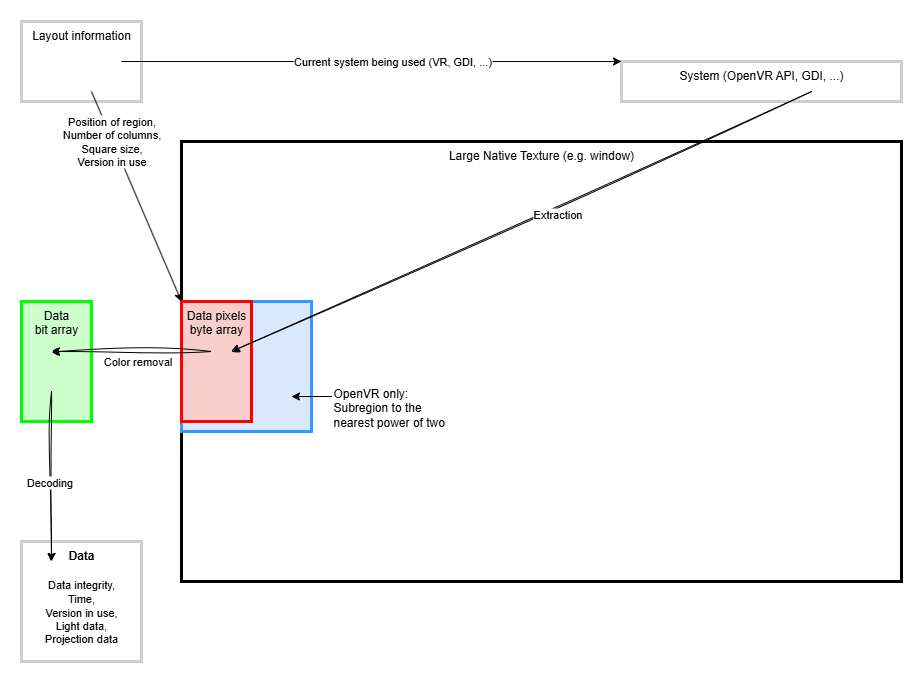

Position System to External Program
====

*Position System to External Program* is a **prefab** and a **program** that lets you connect the position of standard DPS-like lights
to a robotic arm.

Other users can remotely control the position and rotation of your robotic arm through the virtual space.

> [!TIP]
> Only the **computer connected** to the robotic arm needs the software and the prefab. The other users in the virtual space do not need it,
> they just need a standard DPS-like light.
>
> If they already have a standard DPS-like light, then they can control your robotic arm, no additional setup needed from them.

## How is it done?

This is achieved by encoding pixels to the window screen or the image that is projected into the HMD using a special shader.
Our program then reads those pixels.

Data extraction is done using **harmless screen capture** techniques similar to those used by window and VR live-streaming capture programs.
There is no tampering of the computer program nor any active process. There is no OSC either.

In addition:
- The position and rotation of the camera in world space is also extracted. This could be used to pin SteamVR overlays in world space.
- This optionally exposes a WebSocket service to enable control of the robotic arm from virtual space systems like Resonite.

# User documentation

If you are a user looking to use this software, please [check out the end-user documentation](https://alleyway.hai-vr.dev/docs/products/position-system-to-external-program).

- **[📘 Open documentation](https://alleyway.hai-vr.dev/docs/products/position-system-to-external-program)**

&nbsp;

&nbsp;

&nbsp;

&nbsp;

&nbsp;

-----

# Developer documentation

The information below is for developers looking to maintain the application. If you are a user, [check out the end-user documentation instead](https://alleyway.hai-vr.dev/docs/products/position-system-to-external-program).

### Project structure

Main application execution projects:
- **program**: The main entry point is `program/Program.cs`; this bootstraps all dependencies.
- **application-loop**: The main application loop is in `application-loop/Routine.cs`.
  - When the UI window closes, the UI window will ask the application loop to exit the loop.
- **ui-imgui**: The default UI is in `ui-imgui/UiMainApplication.cs`.
  - This runs in a separate UI thread.
  - The framerate of the application loop does not depend on the refresh rate of the UI.
  - All actions from the UI thread that affect the main application are enqueued through `ui-imgui/UiActions.cs` to run in the main thread.

Core projects:
- **core** contains data structures shared by many projects in this solution.
- **decoder** contains the logic necessary to decode images into usable data.
- **robotics** contains the controller that decides how the data will drive the robotic arm.

External system projects:
- **extractor-gdi**, **extractor-openvr**, and **tcode** interact with various external system APIs.
- **service-websockets** is only used if *WebSockets* support is enabled; this skips lights altogether for programs like *Resonite*.

Unity:
- **Packages/dev.hai-vr.alleyway.position-system/** contains the shader and prefab.

### Data extraction procedure

Data extraction goes through this:
- We get a reference to a native texture handle. That texture is very large.
- Using that native texture, we extract a subregion of that texture into a byte array.
- We sample some of these pixels, turning them into zeroes and ones.
- Using that array of bits, we decode the data.



If *WebSockets* support is enabled, the position can be submitted directly from other programs, such as a Websocket component within *Resonite*,
rather than going through data extraction.

### Data

Data is made out of sequential 32-bit groups; least significant bit first, little endian.

Data visually starts at the top-left of the region, scans horizontally up until the layout's width, then vertically.
By default, the layout uses 16 columns, with a margin of 1 on every side.

When rendered on a window, it is drawn at the top left. When rendered in VR, it is drawn centered vertically, located against the left edge of the left eye.
The size of the squares in VR is a fixed proportion of the vertical resolution to counteract the *Resolution Per Eye* setting.

By default, the shader outputs:
- 50% gray for its true value. It is 50% so that it does not trigger bloom on post-processing heavy scenarios.
- A pixel made of negative colors (-10000, -10000, -10000, 1) for its false value, which is perceived as black. The pixel is made of
  negative values so that bloom will not affect the black pixels.

On the program side, we use [Otsu's method](https://en.wikipedia.org/wiki/Otsu%27s_method) on the red channel to choose a threshold
so that the decoding process would function even when post-processing significantly dims the entire screen.

### Shader version 1.1.0

Adding new lines at the end is considered to be a breaking change because the checksum would change, and it would be vertically taller, compromising the vertical centering.
This is why there is reserved space for future use. 

| Group  | Description                                                                                                                                                                                                              | Added in |
|--------|--------------------------------------------------------------------------------------------------------------------------------------------------------------------------------------------------------------------------|----------|
| **0**  | Checksum. See [checksum](#checksum) section below.                                                                                                                                                                       |          |
| **1**  | Time since level load, as given by `_Time.y`. Intended to let the decoder know when the data has changed<br>(i.e. for interpolation, or to detect data stalling).                                                        |          |
| **2**  | A version identifier (x: 1366692562).                                                                                                                                                                                    |          |
| **3**  | A version identifier (y: 1001000). Translates as 1 001 000, because the version is 1.1.0                                                                                                                                 |          |
| **4**  | Position of the 0th light (x), as given by `unity_4LightPosX0[0]`, **in the MeshRenderer's local space**.                                                                                                                |          |
| **5**  | Position of the 0th light (y), as given by `unity_4LightPosY0[0]`, **in the MeshRenderer's local space**.                                                                                                                |          |
| **6**  | Position of the 0th light (z), as given by `unity_4LightPosZ0[0]`, **in the MeshRenderer's local space**.                                                                                                                |          |
| **7**  | Position of the 1st light (x), as given by `unity_4LightPosX0[1]`, **in the MeshRenderer's local space**.                                                                                                                |          |
| **8**  | Position of the 1st light (y), as given by `unity_4LightPosY0[1]`, **in the MeshRenderer's local space**.                                                                                                                |          |
| **9**  | Position of the 1st light (z), as given by `unity_4LightPosZ0[1]`, **in the MeshRenderer's local space**.                                                                                                                |          |
| **10** | Position of the 2nd light (x), as given by `unity_4LightPosX0[2]`, **in the MeshRenderer's local space**.                                                                                                                |          |
| **11** | Position of the 2nd light (y), as given by `unity_4LightPosY0[2]`, **in the MeshRenderer's local space**.                                                                                                                |          |
| **12** | Position of the 2nd light (z), as given by `unity_4LightPosZ0[2]`, **in the MeshRenderer's local space**.                                                                                                                |          |
| **13** | Position of the 3rd light (x), as given by `unity_4LightPosX0[3]`, **in the MeshRenderer's local space**.                                                                                                                |          |
| **14** | Position of the 3rd light (y), as given by `unity_4LightPosY0[3]`, **in the MeshRenderer's local space**.                                                                                                                |          |
| **15** | Position of the 3rd light (z), as given by `unity_4LightPosZ0[3]`, **in the MeshRenderer's local space**.                                                                                                                |          |
| **16** | Color of the 0th light (r), as given by `unity_LightColor[0].x`.                                                                                                                                                         |          |
| **17** | Color of the 0th light (g), as given by `unity_LightColor[0].y`.                                                                                                                                                         |          |
| **18** | Color of the 0th light (b), as given by `unity_LightColor[0].z`.                                                                                                                                                         |          |
| **19** | Color of the 0th light (a), as given by `unity_LightColor[0].w`.                                                                                                                                                         |          |
| **20** | Color of the 1st light (r), as given by `unity_LightColor[1].x`.                                                                                                                                                         |          |
| **21** | Color of the 1st light (g), as given by `unity_LightColor[1].y`.                                                                                                                                                         |          |
| **22** | Color of the 1st light (b), as given by `unity_LightColor[1].z`.                                                                                                                                                         |          |
| **23** | Color of the 1st light (a), as given by `unity_LightColor[1].w`.                                                                                                                                                         |          |
| **24** | Color of the 2nd light (r), as given by `unity_LightColor[2].x`.                                                                                                                                                         |          |
| **25** | Color of the 2nd light (g), as given by `unity_LightColor[2].y`.                                                                                                                                                         |          |
| **26** | Color of the 2nd light (b), as given by `unity_LightColor[2].z`.                                                                                                                                                         |          |
| **27** | Color of the 2nd light (a), as given by `unity_LightColor[2].w`.                                                                                                                                                         |          |
| **28** | *Supposed to be* the color of the 3rd light (r), as given by `unity_LightColor[3].x`. See notes below\*                                                                                                                  |          |
| **29** | *Supposed to be* the color of the 3rd light (g), as given by `unity_LightColor[3].y`. See notes below\*                                                                                                                  |          |
| **30** | *Supposed to be* the color of the 3rd light (b), as given by `unity_LightColor[3].z`. See notes below\*                                                                                                                  |          |
| **31** | *Supposed to be* the color of the 3rd light (a), as given by `unity_LightColor[3].w`. See notes below\*                                                                                                                  |          |
| **32** | Attenuation of the 0th light, as given by `unity_4LightAtten0[0]`.                                                                                                                                                       |          |
| **33** | Attenuation of the 1st light, as given by `unity_4LightAtten0[1]`.                                                                                                                                                       |          |
| **34** | Attenuation of the 2nd light, as given by `unity_4LightAtten0[2]`.                                                                                                                                                       |          |
| **35** | Attenuation of the 3rd light, as given by `unity_4LightAtten0[3]`.                                                                                                                                                       |          |
| **36** | Position of the camera (x) in world space.                                                                                                                                                                               | \>=1.1.0 |
| **37** | Position of the camera (y) in world space.                                                                                                                                                                               | \>=1.1.0 |
| **38** | Position of the camera (z) in world space.                                                                                                                                                                               | \>=1.1.0 |
| **39** | Euler angles of the camera (x) in world space, in degrees, using the ZXY rotation order (same as [Unity](https://docs.unity3d.com/ScriptReference/Quaternion.Euler.html)).                                               | \>=1.1.0 |
| **40** | Euler angles of the camera (y) in world space, in degrees, using the ZXY rotation order (same as [Unity](https://docs.unity3d.com/ScriptReference/Quaternion.Euler.html)).                                               | \>=1.1.0 |
| **41** | Euler angles of the camera (y) in world space, in degrees, using the ZXY rotation order (same as [Unity](https://docs.unity3d.com/ScriptReference/Quaternion.Euler.html)).                                               | \>=1.1.0 |
| **42** | Unused, reserved for future non-breaking use. This is part of the checksum.                                                                                                                                              |          |
| **43** | Unused, reserved for future non-breaking use. This is part of the checksum.                                                                                                                                              |          |
| **44** | Unused, reserved for future non-breaking use. This is part of the checksum.                                                                                                                                              |          |
| **45** | Unused, reserved for future non-breaking use. This is part of the checksum.                                                                                                                                              |          |
| **46** | Unused, reserved for future non-breaking use. This is part of the checksum.                                                                                                                                              |          |
| **47** | Unused, reserved for future non-breaking use. This is part of the checksum.                                                                                                                                              |          |
| **48** | Unused, reserved for future non-breaking use. This is part of the checksum.                                                                                                                                              |          |
| **49** | Unused, reserved for future non-breaking use. This is part of the checksum.                                                                                                                                              |          |
| **50** | Unused, reserved for future non-breaking use. This is part of the checksum.                                                                                                                                              |          |
| **51** | Canary. Equal to 1431677610, which results in a checkerboard pattern in binary. This is used to help solve alignment issues.<br/>This value can change in the future. The program will not check if this value is equal. |          |

\* *The value of `unity_LightColor[3]` may be disrupted if the scene contains a directional light due to a Unity quirk, so this value may not be trusted to detect point lights.*

### Checksum

The data can easily get corrupted if a SteamVR overlay overlaps the data region, or in some cases, game UI, post-processing, some rare transparent objects,
or special shaders may interfere with the data region.

When this happens, we need to detect this happening and disregard any decoded data.

To do this, we calculate a CRC-32 hash in the shader that this program will check.

If the check fails, we reuse the last known valid data.

The CRC-32 hash is based on groups 1 to 51 (inclusive). The data in 42 to 51 (inclusive) are not currently used.
However, including them as part of the checksum ensures that it is not a breaking change to add a few additional pieces of
new data in the shader for future versions.

### WebSockets as an alternative input system

If *WebSockets* support is enabled, we will expose a websocket on port **56247** at url `ws://localhost:56247/ws`

Send the following string to it that represents an interpreted position and normal:
```text
PositionSystemInterpreted PositionX PositionY PositionZ NormalX NormalY NormalZ
```
- *PositionX*, *PositionY*, *PositionZ* is the position in local space, where (0, 0, 0) is the bottommost center, and (0, 1, 0) is the uppermost center.
- *NormalX*, *NormalY*, *NormalZ* is the direction, represented as a vector of length 1. It doesn't matter if you don't make it length 1, we will normalize it anyway.

While you're at it, you can also submit the tangent, which can be useful to define the twist, but this is optional:
```text
PositionSystemInterpreted PositionX PositionY PositionZ NormalX NormalY NormalZ TangentX TangentY TangentZ
```
- *TangentX*, *TangentY*, *TangentZ* is the tangent (which is a vector perpendicular to the direction), represented as a vector of length 1. It doesn't matter if you don't make it length 1, we will normalize it anyway.
  
- TODO: Clarify the expected coordinate space.
- TODO: Clarify where the direction should point to.

Here is a short Python Jupyter notebook that sends a message to this service:
```python
#%%
!pip install websockets nest_asyncio

import asyncio
import websockets
import nest_asyncio

# This allows asyncio to work properly in Jupyter
nest_asyncio.apply()

async def send_message():
    uri = "ws://localhost:56247/ws"
    async with websockets.connect(uri) as websocket:
        message = "PositionSystemInterpreted 0.0 0.1 0.2 0.3 0.4 0.5"
        await websocket.send(message)
        print(f"Sent message: {message}")

await send_message()
```

### Third-party acknowledgements

Third party acknowledgements can also be found in the thirdparty-licenses/ThirdParty/ subfolder:
- For the full license text of the third party dependencies, open thirdparty-licenses/THIRDPARTY-LICENSES/ folder

Included in source code form and DLLs:
- ImGui.NET SampleProgram @ https://github.com/ImGuiNET/ImGui.NET/tree/master/src/ImGui.NET.SampleProgram ([MIT license](https://github.com/ImGuiNET/ImGui.NET/blob/master/LICENSE)) by Eric Mellino and ImGui.NET contributors
- OpenVR API @ https://github.com/ValveSoftware/openvr ([BSD-3-Clause license](https://github.com/ValveSoftware/openvr/blob/master/LICENSE)) by Valve Corporation
- openvr-screengrab @ https://github.com/cnlohr/openvr-screengrab ([MIT license](https://github.com/cnlohr/openvr-screengrab/blob/master/LICENSE)) by CNLohr

Dependencies included through NuGet:
- Dear ImGui @ https://github.com/ocornut/imgui ([MIT license](https://github.com/ocornut/imgui/blob/master/LICENSE.txt)) by Omar Cornut
- ImGui.NET @ https://github.com/ImGuiNET/ImGui.NET ([MIT license](https://github.com/ImGuiNET/ImGui.NET/blob/master/LICENSE)) by Eric Mellino and ImGui.NET contributors
- Veldrid @ https://github.com/veldrid/veldrid ([MIT license](https://github.com/veldrid/veldrid/blob/master/LICENSE)) by Eric Mellino and Veldrid contributors
- Vortice.Windows @ https://github.com/amerkoleci/Vortice.Windows ([MIT license](https://github.com/amerkoleci/Vortice.Windows/blob/main/LICENSE)) by Amer Koleci and Contributors
- (there may be other implicit packages)

Asset dependencies:
- ProggyClean font @ http://www.proggyfonts.net/ ([MIT License (According to https://github.com/ocornut/imgui/blob/master/docs/FONTS.md#creditslicenses-for-fonts-included-in-repository)](https://github.com/ocornut/imgui/blob/master/docs/FONTS.md#creditslicenses-for-fonts-included-in-repository)) by Tristan Grimmer
- Roboto font @ https://fonts.google.com/specimen/Roboto/about ([SIL Open Font License](https://fonts.google.com/attribution)) by Christian Robertson, Paratype, Font Bureau
